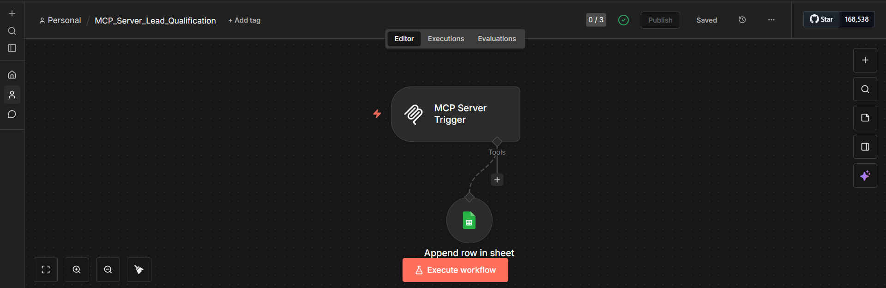
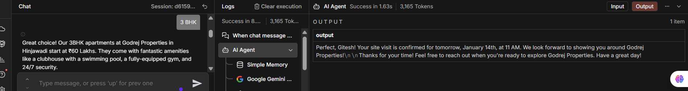
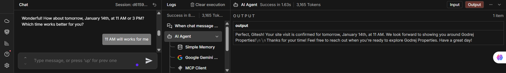
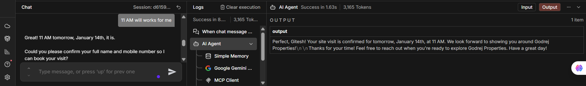
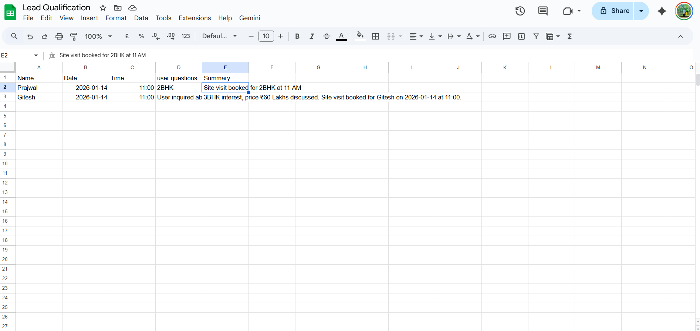

# 🤖 MCP-Based Lead Qualification Chatbot (n8n)

An AI-powered chatbot that automates **real-estate lead qualification**, **site visit scheduling**, and **lead storage** using **n8n** and **MCP Client–Server architecture**.

---

## 📌 Project Overview
This project demonstrates how low-code automation and AI can be combined to build a **smart conversational chatbot**.  
The chatbot interacts with users, understands their requirements, schedules site visits, and automatically stores qualified lead data in **Google Sheets**.

---

## ✨ Key Features
- 💬 AI-driven conversational chatbot
- 🔗 MCP Client–Server communication
- 🏠 Real-estate lead qualification
- 📅 Automated site visit scheduling
- 📊 Lead storage in Google Sheets
- 🧠 Memory-enabled conversation handling

---

## 🏗️ System Architecture

User Chat

↓

n8n Chat Trigger

↓

AI Agent (Google Gemini + Memory)

↓

MCP Client

↓

MCP Server

↓

Google Sheets (Lead Storage)

---

## ⚙️ Tech Stack
- **n8n** (Workflow Automation)
- **Google Gemini Chat Model**
- **MCP Client & MCP Server**
- **Google Sheets**
- **AI Agent with Memory**

---

## 📂 Project Structure

MCP_Lead_Qualification_Chatbot/

├── screenshots/

├── workflows/

└── README.md

---

## 🔄 Workflow Details

### 1️⃣ MCP Client – Lead Qualification
This workflow handles all **user interactions** and lead qualification logic.

**Responsibilities:**
- Receives user messages
- Uses AI Agent for intelligent conversation
- Collects:
  - 👤 Name
  - 📞 Mobile number
  - 🏢 Apartment type (2BHK / 3BHK / 4BHK)
  - ⏰ Site visit time
- Sends structured data to MCP Server

📸 **Client Workflow**

---

---

### 2️⃣ MCP Server – Lead Storage
This workflow is responsible for **persisting qualified leads**.

**Responsibilities:**
- Receives structured lead data from MCP Client
- Appends lead details to Google Sheets

📸 **Server Workflow**

---

---

## 💬 Sample Chat Flow

📸 **Chat Interaction Examples**

---

---

---

---

---

---

---

## 📊 Output – Google Sheets
All qualified leads are stored automatically for easy access and tracking.

📸 **Lead Storage Example**

---

---

## 🚀 How to Run This Project
1. Import the workflows into **n8n**
2. Configure:
   - Google Gemini API credentials
   - Google Sheets credentials
3. Activate both workflows
4. Start chatting with users

---

## 🎯 Use Cases
- 🏠 Real-estate lead qualification
- 📅 Appointment scheduling bots
- 📈 Sales automation
- 🗂️ CRM data collection

---
